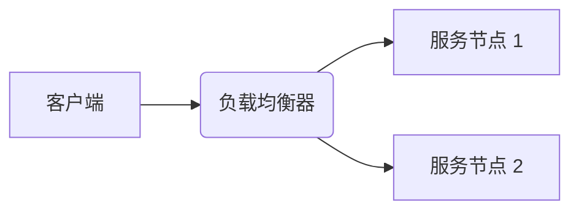
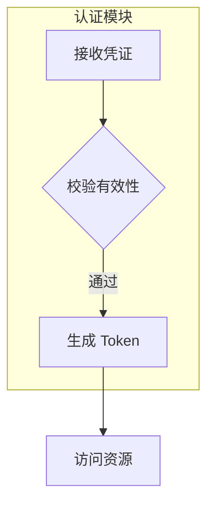

在软件开发领域，技术文档的可读性直接影响团队协作效率与知识传递效果。传统绘图工具如 Visio 或 Draw.io 虽然功能强大，但其二进制文件格式与代码仓库的文本特性存在天然隔阂。Mermaid.js 作为一款基于文本的图表生成库，通过将图表定义为可版本控制的代码，完美解决了文档与图表同步更新的难题。其 `9.4KB` 的轻量化体积与 Markdown 原生支持特性，使其成为技术写作领域的颠覆性工具。

## 第一部分：Mermaid.js 基础入门  
要在 Markdown 中启用 Mermaid.js 渲染，仅需添加以下 HTML 引用：  
```html
<script src="https://cdn.jsdelivr.net/npm/mermaid@10.6.1/dist/mermaid.min.js"></script>
```  
当声明流程图时，方向控制符 `TD`（Top-Down）与 `LR`（Left-Right）决定了图表的布局走向。节点定义采用简洁的标识符语法：  

此代码中 `A` 节点的方括号表示矩形，圆括号 `B()` 生成圆角矩形。箭头运算符 `-->` 自动创建带箭头的连接线，这种声明式语法使得图表结构一目了然。

## 第二部分：流程图的绘制与实战  
复杂业务流程往往需要多级嵌套结构。通过 `subgraph` 语法可以创建逻辑分组：  

此处的 `subgraph` 会生成带有背景色的容器，`TB` 指定了自上而下的布局方向。连接线条件分支使用 `| 条件 |` 语法标注，`{校验有效性}` 的菱形节点天然适合表示决策点。  

样式定制可通过 CSS 类实现：  
```mermaid
flowchart LR
  classDef cluster fill:#f9f9f9,stroke:#333;
  subgraph 数据库集群 :::cluster
    A[(主库)]
    B[(从库 1)]
    C[(从库 2)]
  end
```  
`classDef` 指令定义了名为 `cluster` 的样式类，圆括号 `()` 表示圆柱形数据库节点，`:::cluster` 将样式应用于子图容器。

## 第三部分：架构图的绘制与优化  
微服务架构图需要清晰展示组件边界。使用 `container` 语法可以创建带有标题的分组：  
```mermaid
flowchart LR
  container 网关层 {
    A[API Gateway]
    B[Auth Service]
  }
  container 业务层 {
    C[Order Service]
    D[Payment Service]
  }
  A --> C & D
```  
该代码通过 `&` 符号实现单节点到多节点的并行连接。若需添加交互功能，可嵌入点击事件：  

`click` 指令为节点添加了超链接，`_blank` 参数指定在新标签页打开。导出为 SVG 时需调用 `mermaid.initialize()` 并设置 `securityLevel: 'loose'` 以保留交互特性。

## 第四部分：与其他工具的集成与自动化  
在 VuePress 中集成 Mermaid.js 只需安装官方插件：  
```bash
npm install vuepress-plugin-mermaidjs
```  
配置文件中添加：  
```javascript
module.exports = {
  plugins: ['mermaidjs']
}
```  
此时所有 ````mermaid` 代码块都会自动渲染为矢量图表。对于 CI/CD 流水线，可通过 `mermaid-cli` 实现自动化导出：  
```bash
mmdc -i input.mmd -o output.png -t dark
```  
`-t` 参数指定主题样式，支持 `default`、`dark`、`forest` 等多种预设，确保生成图表与文档主题风格一致。

## 第五部分：最佳实践与避坑指南  
当遇到渲染异常时，可优先检查方向控制符是否冲突。例如在 `flowchart` 类型中使用 `graph TD` 声明会导致解析失败，正确写法应为 `flowchart TB`。对于包含大量节点（超过 50 个）的复杂图表，建议启用 `%%{init: {"flowchart": {"useMaxWidth": false}} }%%` 初始化指令禁用响应式布局以避免元素重叠。

Mermaid.js 的生态正在加速进化，近期新增的饼图与用户体验地图支持，使其应用场景突破传统技术文档范畴。与 PlantUML 相比，Mermaid.js 的 JavaScript 原生特性使其更适配现代 Web 技术栈。建议读者从简单的 API 流程图开始实践，逐步将架构文档迁移到这套「代码即图表」的新范式。当团队所有成员都能通过 `git diff` 直观查看图表变更时，技术协作将进入全新的维度。
